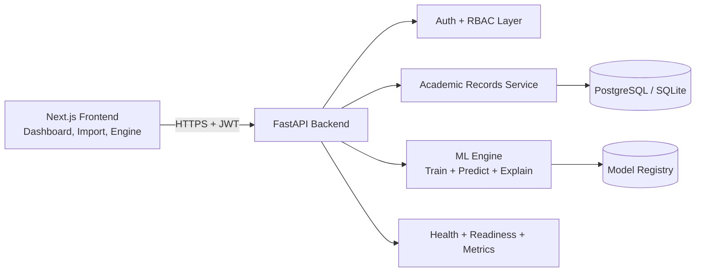
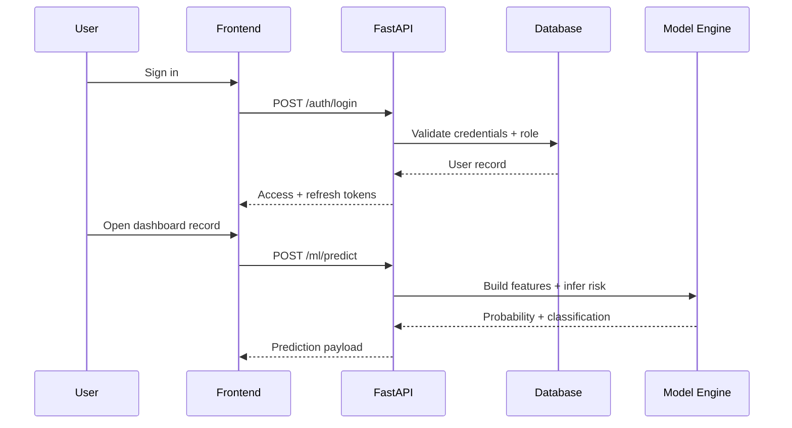
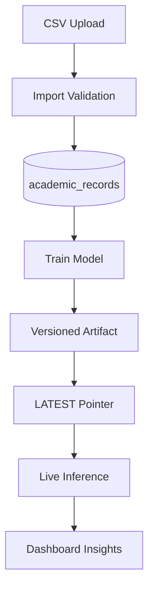

<p align="center">
  
</p>

<p align="center">
  
</p>

<p align="center">
  
  
  
  
</p>

<p align="center">
  
  
</p>

## Overview

EduPredict is an end-to-end academic risk intelligence platform that predicts whether a student is likely to become At-Risk or remain Not-At-Risk using attendance, assignments, quizzes, exams, and GPA signals.

The system combines:

1. A modern Next.js analytics UI
2. A FastAPI backend with JWT + RBAC
3. A production-ready ML training/inference pipeline
4. Admin and teacher workflows for importing records and operating the model directly from the web app

## Live Project URLs

- Frontend URL (Vercel): https://edupredictfrontend.vercel.app
- Backend API (Vercel): https://edupredict-seven.vercel.app
- API Docs: https://edupredict-seven.vercel.app/docs
- API Health: https://edupredict-seven.vercel.app/health

## Key Features

- Role-based experience for Admin, Teacher, and Student
- Secure JWT authentication and refresh-token flow
- CSV import pipeline for academic records (summary + RUET-style course marks)
- Model training from imported metadata through admin UI
- Prediction and explanation endpoints with dashboard integration
- Versioned model registry and promotion flow

## Visual System Design

### High-Level Architecture


```mermaid
flowchart LR
    FE[Next.js Frontend\nDashboard, Import, Engine] -->|HTTPS + JWT| API[FastAPI Backend]
    API --> AUTH[Auth + RBAC Layer]
    API --> ACAD[Academic Records Service]
    API --> MLE[ML Engine\nTrain + Predict + Explain]
    ACAD --> DB[(PostgreSQL / SQLite)]
    MLE --> REG[(Model Registry)]
    API --> OBS[Health + Readiness + Metrics]
```

### Request Flow: Login to Prediction


```mermaid
sequenceDiagram
    participant U as User
    participant FE as Frontend
    participant API as FastAPI
    participant DB as Database
    participant ML as Model Engine

    U->>FE: Sign in
    FE->>API: POST /auth/login
    API->>DB: Validate credentials + role
    DB-->>API: User record
    API-->>FE: Access + refresh tokens

    U->>FE: Open dashboard record
    FE->>API: POST /ml/predict
    API->>ML: Build features + infer risk
    ML-->>API: Probability + classification
    API-->>FE: Prediction payload
```

### Data and Model Lifecycle


```mermaid
flowchart TD
    CSV[CSV Upload] --> IMP[Import Validation]
    IMP --> ACAD[(academic_records)]
    ACAD --> TRN[Train Model]
    TRN --> VER[Versioned Artifact]
    VER --> LAT[LATEST Pointer]
    LAT --> INF[Live Inference]
    INF --> UI[Dashboard Insights]
```

## Technology Stack

- Frontend: Next.js App Router, TypeScript, Tailwind CSS
- Backend: FastAPI, SQLAlchemy Async, Alembic, Pydantic
- Security: JWT access/refresh tokens, role-based authorization
- ML: NumPy, Pandas, scikit-learn, LightGBM, joblib
- Deployment: Vercel (frontend + backend as separate projects)
- Database: SQLite (local), PostgreSQL (production)

## Repository Structure

- apps/frontend: Next.js application UI
- apps/backend: FastAPI API, services, ML pipeline
- docker-compose.yml: local Postgres workflow

## Local Development

### Backend

```bash
python -m pip install -e apps/backend
cd apps/backend
python -m alembic upgrade head
python -m uvicorn app.main:app --reload --host 127.0.0.1 --port 8000
```

### Frontend

```bash
npm --prefix apps/frontend install
npm --prefix apps/frontend run dev
```

Set frontend environment value:

- NEXT_PUBLIC_API_BASE_URL=http://127.0.0.1:8000

<p align="center">
  Built with precision for academic analytics, system reliability, and explainable AI workflows.
</p>
